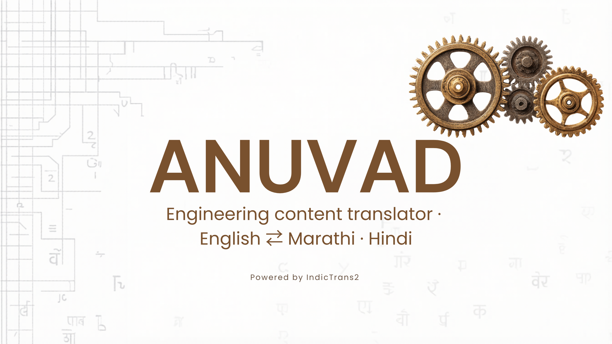
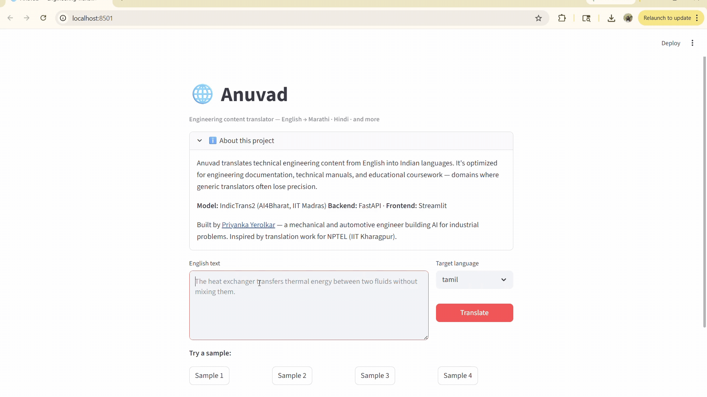

<p align="center">
  
</p>

<p align="center">
  
</p>

<h1 align="center">Anuvad </h1>
<p align="center">
  <em>Engineering content translator — English ⇄ Marathi & Hindi</em>
</p>

<p align="center">
  <a href="https://huggingface.co/spaces/Priyerolkar/anuvad">
    
  </a>
  
  
  
</p>

---

##  What it does

Anuvad translates technical engineering content from English into Marathi and Hindi (with support for Tamil, Bengali, Telugu, Gujarati, and Kannada). It's built for engineering documentation, technical manuals, educational coursework, and CAD/manufacturing content — domains where generic translators often lose precision.

**Try the live demo:** [huggingface.co/spaces/Priyerolkar/anuvad](https://huggingface.co/spaces/Priyerolkar/anuvad) *(replace with your URL after deployment)*

##  The problem

Generic translation tools handle conversational text well but struggle with engineering domain vocabulary — terms like *deep drawing*, *heat exchanger*, *feed rate*, or *tolerance stack-up* often translate awkwardly or lose precision in Indian languages. This matters for technical education and documentation, where mistranslating a term can change the meaning of an entire procedure.

I encountered this firsthand while volunteering as a technical translator for **NPTEL (IIT Kharagpur)** in 2021, where I translated 10.5+ hours of engineering coursework into Marathi (Energy Conservation & Waste Heat Recovery; Engineering Drawing & Computer Graphics). Anuvad is the productized version of that work.

##  How it works

| Component  | Tech                                        |
|------------|---------------------------------------------|
| Model      | IndicTrans2 distilled 200M (AI4Bharat)      |
| Backend    | FastAPI                                     |
| Frontend   | Streamlit                                   |
| Deployment | Hugging Face Spaces (CPU)                   |
| Evaluation | sacreBLEU, chrF                             |

The system loads IndicTrans2 once on startup, exposes a `/translate` endpoint via FastAPI, and serves a Streamlit UI. Users paste English engineering text, pick a target language, and get translation + latency metrics.

```
User input (English engineering text)
    ↓
FastAPI backend (/translate)
    ↓
IndicTrans2 (preprocess → generate → postprocess)
    ↓
Translation + latency
    ↓
Streamlit UI
```

##  Results

Evaluated on a hand-curated set of **20 engineering sentences** drawn from NPTEL coursework, mechanical engineering textbooks, and automotive manuals.

| Direction          | n  | BLEU  | chrF  | Avg latency | P95 latency |
|--------------------|----|-------|-------|-------------|-------------|
| English → Marathi  | 20 | 30.39 | 66.18 | 588 ms      | 701 ms      |
| English → Hindi    | 20 | 42.57 | 65.85 | 592 ms      | 680 ms      |

> BLEU and chrF computed with `sacrebleu`. Latency measured per-sentence on CPU.
> Run `python -m evaluation.evaluate` to reproduce. Full test set in [`evaluation/test_set.csv`](evaluation/test_set.csv).

**Context for these numbers:** BLEU 30+ is considered strong for any translation system, and 40+ is very good. The Hindi result (BLEU 42.57) reflects the larger amount of training data IndicTrans2 has for Hindi compared to Marathi. Both directions translate domain-specific engineering vocabulary correctly — terms like *deep drawing*, *tolerance stack-up*, and *heat exchanger* are preserved with technical precision.


##  Run it locally

**Requirements:** Python 3.10+, ~2 GB free disk for model download.

```bash
git clone https://github.com/Priyerolkar/Anuvad.git
cd Anuvad
python -m venv .venv && source .venv/bin/activate   # Windows: .venv\Scripts\activate
pip install -r requirements.txt

# If you hit dependency issues, use the locked versions:
# pip install -r requirements-locked.txt
```

**Start the Streamlit UI** (calls the model directly):

```bash
streamlit run app.py
```

**Or start the FastAPI backend separately:**

```bash
uvicorn api.main:app --reload --port 8000
# Visit http://localhost:8000/docs for the interactive Swagger UI
```

**Smoke test the translator from Python:**

```bash
python -m api.translator
```

##  Run the evaluation

```bash
python -m evaluation.evaluate                    # Both Marathi and Hindi
python -m evaluation.evaluate --target marathi   # One language
python -m evaluation.evaluate --limit 5          # Quick test on first 5 rows
```

Results are written to `evaluation/results.md`. Paste the table into the README's Results section.

##  Repo structure

```
anuvad/
├── api/
│   ├── translator.py      # IndicTrans2 wrapper (core)
│   └── main.py            # FastAPI service
├── evaluation/
│   ├── test_set.csv       # Hand-curated engineering sentences
│   ├── evaluate.py        # BLEU + chrF scoring
│   └── results.md         # Latest scores (auto-written)
├── tests/
│   └── test_translator.py # Pytest smoke tests
│
├── assets/                # Banner, demo GIF
├── app.py                 # Streamlit frontend
├── requirements.txt
└── README.md
```

##  Roadmap

- [x] IndicTrans2 baseline (Marathi, Hindi)
- [x] FastAPI service + Streamlit UI
- [x] Engineering test set (n=20) + sacreBLEU evaluation
- [x] Pure-Python preprocessing (no native dependencies)
- [ ] Deploy to Hugging Face Spaces
- [ ] Expand test set to 200 sentences across 5 engineering subdomains
- [ ] Glossary-aware translation (preserve technical terms)
- [ ] Document upload (PDF → translated PDF)
- [ ] Compare against Google Translate baseline
- [ ] Fine-tune on engineering parallel corpus

##  Built by

**Priyanka Yerolkar** — Mechanical & Automotive engineer building AI for industrial problems.
B.E. Mechanical · M.E. Automotive Engineering · Published research on deep drawing forming parameters (IJAuERD, 2020).

[LinkedIn](https://linkedin.com/in/priyankayerolkar) · [GitHub](https://github.com/Priyerolkar)

##  Acknowledgements

- [AI4Bharat](https://ai4bharat.iitm.ac.in/) for [IndicTrans2](https://github.com/AI4Bharat/IndicTrans2)
- [NPTEL (IIT Kharagpur)](https://nptel.ac.in/) for the technical translation program that inspired this project

##  License

MIT — see [LICENSE](LICENSE).
